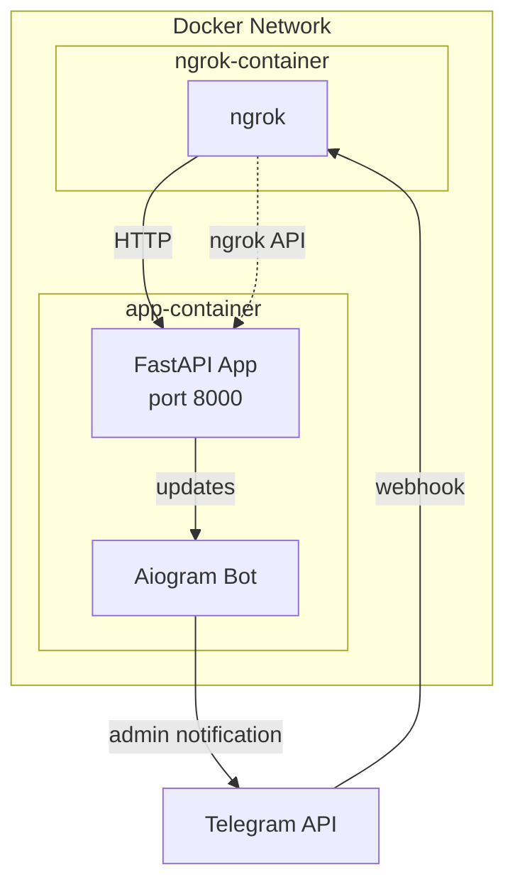
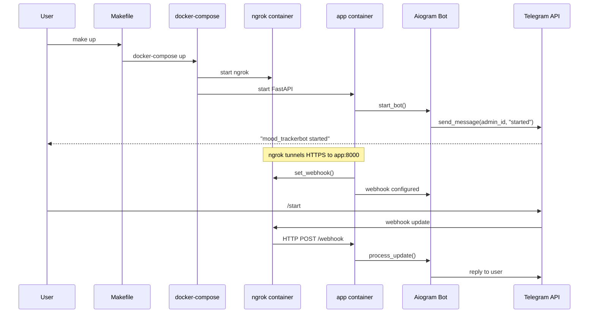

# Docker Setup Plan for MoodTracker Bot

## Overview
This plan describes how to set up the MoodTracker Bot to run entirely in Docker containers, with ngrok providing external HTTPS access for Telegram webhooks.

## Current State Analysis

### Existing Configuration
- **`.env`** contains:
  - `BOT_TOKEN` - Telegram bot token
  - `ADMIN_IDS=[112033576]` - Admin user ID
  - `BASE_URL=heroic-concise-halibut.ngrok-free.app` - Ngrok domain
  - `NGROK_AUTHTOKEN` - Ngrok authentication token
  - `NGROK_URL` - Ngrok URL

- **`ngrok.yml`** is configured to:
  - Use the authtoken from `.env`
  - Forward HTTP traffic to `host.docker.internal:8000` (FastAPI app)
  - Use the domain `heroic-concise-halibut.ngrok-free.app`

- **Application** (`app/main.py`):
  - Runs FastAPI on port 8000
  - Uses webhook mode for Telegram bot
  - Sends admin notifications on start/stop

### Missing Components
1. `Dockerfile` for the FastAPI application
2. `docker-compose.yml` for orchestrating services
3. `Makefile` with convenient commands

## Architecture Diagram

## Implementation Plan

### Step 1: Create Dockerfile for FastAPI Application

**File**: `Dockerfile`

**Requirements**:
- Base image: Python 3.12 (from `.python-version`)
- Install dependencies using `uv` (project uses uv)
- Copy application code
- Expose port 8000
- Set working directory
- Run command: `uvicorn app.main:app --host 0.0.0.0 --port 8000`

**Key considerations**:
- Use multi-stage build for smaller image size
- Mount volume for database persistence
- Set environment variables from `.env`

### Step 2: Create docker-compose.yml

**File**: `docker-compose.yml`

**Services**:

1. **app** - FastAPI application
   - Build from Dockerfile
   - Port mapping: `8000:8000`
   - Environment variables from `.env`
   - Volume: `./data:/app/data` (for database)
   - Depends on: ngrok (optional, can run independently)
   - Network: shared network with ngrok

2. **ngrok** - Ngrok tunnel
   - Image: `ngrok/ngrok:latest`
   - Command: `http --domain=${NGROK_URL} 8000`
   - Environment: `NGROK_AUTHTOKEN`
   - Volumes: `./ngrok.yml:/etc/ngrok.yml`
   - Network: shared network with app

**Network**:
- Create shared network for inter-service communication

### Step 3: Create Makefile

**File**: `Makefile`

**Commands**:
- `make build` - Build Docker images
- `make up` - Start all services
- `make down` - Stop all services
- `make logs` - View logs
- `make logs-app` - View app logs
- `make logs-ngrok` - View ngrok logs
- `make restart` - Restart services
- `make clean` - Remove containers and volumes

### Step 4: Configuration Updates

**Update `ngrok.yml`**:
- Change `addr` from `host.docker.internal:8000` to `app:8000` (service name in docker-compose)
- This allows ngrok container to reach app container within Docker network

**Update `.env`** (if needed):
- Ensure all required variables are set
- `BASE_URL` should match ngrok domain

### Step 5: Testing Procedure

1. Build images: `make build`
2. Start services: `make up`
3. Check ngrok logs: `make logs-ngrok`
4. Check app logs: `make logs-app`
5. Verify webhook is set (check app logs)
6. Verify admin receives notification message

## Expected Flow

## Files to Create

1. `Dockerfile` - Application container definition
2. `docker-compose.yml` - Service orchestration
3. `Makefile` - Convenience commands

## Files to Modify

1. `ngrok.yml` - Update tunnel address for Docker network

## Success Criteria

- [ ] All services start without errors
- [ ] Ngrok successfully creates tunnel
- [ ] FastAPI app is accessible via ngrok URL
- [ ] Bot webhook is configured correctly
- [ ] Admin receives "bot started" notification
- [ ] Bot responds to `/start` command

## Troubleshooting Notes

1. **Ngrok tunnel address**: Use service name (`app:8000`) instead of `host.docker.internal:8000` for container-to-container communication
2. **Database persistence**: Ensure volume is mounted for `/app/data`
3. **Environment variables**: All variables from `.env` must be passed to containers
4. **Webhook URL**: The app fetches ngrok URL from localhost:4040 API - this may need adjustment for Docker environment
