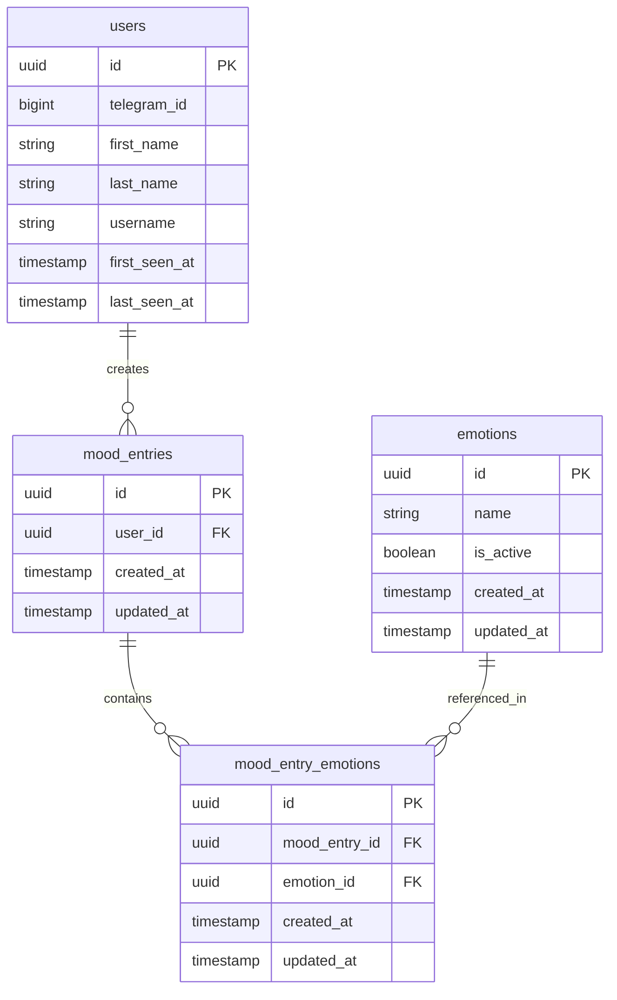
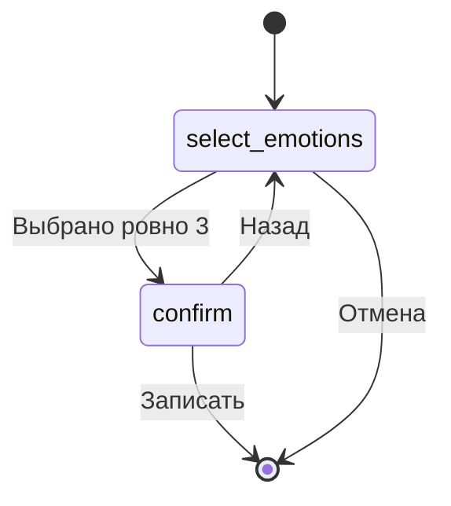
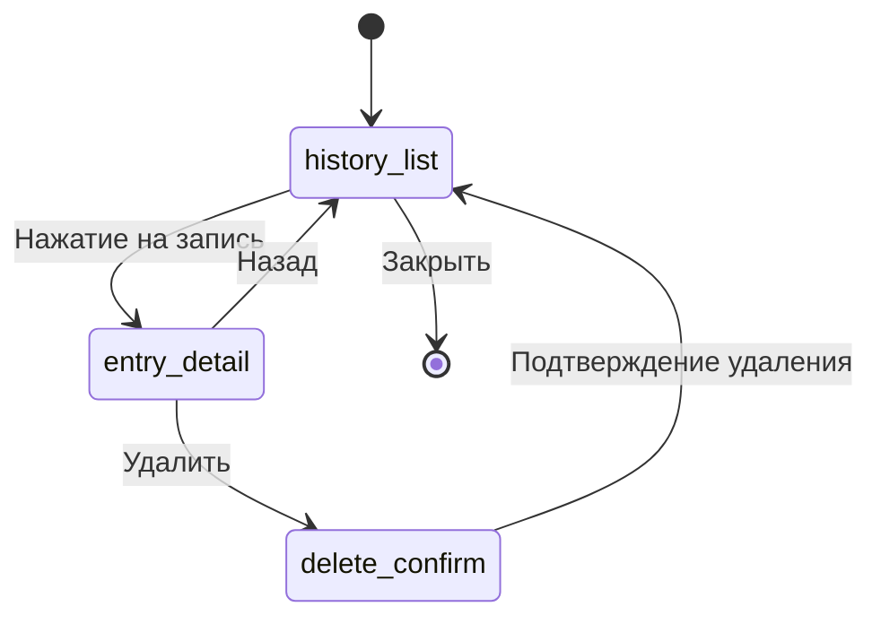
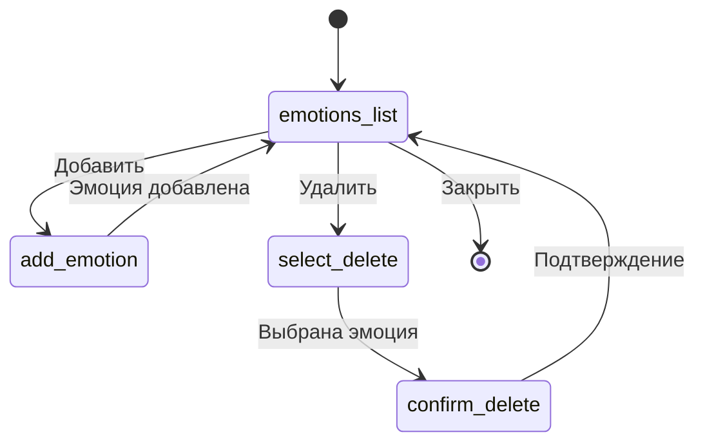

# Mood Tracker — Core Functionality Plan

## Overview

Добавление основного функционала трекера настроения в существующего Telegram-бота.

**Текущее состояние:** Бот с инфраструктурой (FastAPI + Aiogram webhook, PostgreSQL, Docker, user tracking middleware), но без бизнес-логики трекинга настроения.

**Целевое состояние:** Полноценный трекер настроения с записями, историей, админкой для управления эмоциями и архитектурой i18n.

---

## 1. Database Schema

### 1.1. New model: `Emotion`

```
emotions
├── id: UUID (PK)
├── name: String(100) — название эмоции на русском
├── is_active: Boolean, default=True — soft delete
├── created_at: TIMESTAMP
└── updated_at: TIMESTAMP
```

### 1.2. New model: `MoodEntry`

```
mood_entries
├── id: UUID (PK)
├── user_id: UUID (FK → users.id, CASCADE)
├── created_at: TIMESTAMP
└── updated_at: TIMESTAMP
```

### 1.3. New model: `MoodEntryEmotion` (join table)

```
mood_entry_emotions
├── id: UUID (PK)
├── mood_entry_id: UUID (FK → mood_entries.id, CASCADE)
├── emotion_id: UUID (FK → emotions.id)
├── created_at: TIMESTAMP
└── updated_at: TIMESTAMP
```

### ER Diagram



### 1.4. Seed data

Начальный список эмоций (примерно 15-20 пунктов):
спокойствие, радость, тревога, грусть, злость, усталость, бодрость, вдохновение, скука, нежность, уверенность, растерянность, благодарность, раздражение, воодушевление, апатия, интерес, страх, гордость, одиночество

---

## 2. DAO Layer

### 2.1. `EmotionDAO` — новый файл `app/dao/emotion_dao.py`

| Метод | Описание |
|---|---|
| `get_all_active(session)` | Все активные эмоции, упорядоченные по имени |
| `get_by_id(session, emotion_id)` | Получить эмоцию по ID |
| `add(session, name)` | Добавить новую эмоцию |
| `soft_delete(session, emotion_id)` | Деактивировать эмоцию (is_active=False) |

### 2.2. `MoodEntryDAO` — новый файл `app/dao/mood_dao.py`

| Метод | Описание |
|---|---|
| `create_entry(session, user_id, emotion_ids)` | Создать запись с 3 эмоциями (в одной транзакции) |
| `get_user_entries(session, user_id, limit, offset)` | Получить записи пользователя с пагинацией, с eager load эмоций |
| `get_last_entry(session, user_id)` | Получить последнюю запись пользователя |
| `delete_entry(session, entry_id)` | Удалить запись по ID |

---

## 3. i18n Infrastructure

### 3.1. Подход

Используем встроенную i18n поддержку aiogram (`aiogram.utils.i18n`):
- `SimpleI18nMiddleware` с gettext
- Локали хранятся в `app/i18n/locales/`
- Язык по умолчанию: `ru`
- В первой версии — только русский, но все строки через `_()`

### 3.2. Структура файлов

```
app/i18n/
├── __init__.py
├── loader.py          — настройка i18n middleware
└── locales/
    └── ru/
        └── LC_MESSAGES/
            └── bot.po  — русский перевод (единственный в v1)
```

### 3.3. Интеграция

- Зарегистрировать `I18nMiddleware` в диспетчере
- Все строки в диалогах и хендлерах через функцию перевода
- Локаль пользователя хранится в `dialog_manager.middleware_data` или определяется из настроек

---

## 4. User Dialogs (aiogram-dialog)

### 4.1. Mood Dialog — `app/bot/user/mood_dialog.py`

**Команда:** `/mood`

**Flow:**



**State `select_emotions`:**
- Getter загружает все активные эмоции из БД
- `Multiselect` виджет с пагинацией (по 5-6 кнопок на страницу)
- Выбранные кнопки помечаются визуально (✅)
- Счётчик: «Выбрано: {n}/3»
- Кнопка «Записать» активна только при ровно 3 выбранных
- Кнопка «Отмена»

**State `confirm`:**
- Показывает выбранные 3 эмоции
- Кнопки «Записать ✅» и «Назад ↩️»

**Callback `on_save`:**
- Сохраняет `MoodEntry` + 3 `MoodEntryEmotion` в БД
- Показывает сообщение «Запись сохранена!»
- Закрывает диалог

### 4.2. History Dialog — `app/bot/user/history_dialog.py`

**Команда:** `/history`

**Flow:**



**State `history_list`:**
- Getter загружает последние N записей пользователя (с пагинацией)
- Каждая запись отображается как кнопка: «01.05 — радость, бодрость, уверенность»
- Пагинация: «← →» кнопки
- Если записей нет: «У вас пока нет записей»
- Кнопка «Закрыть»

**State `entry_detail`:**
- Полная информация о записи: дата, время, список эмоций
- Кнопка «Удалить 🗑️» (доступна только для последней записи)
- Кнопка «Назад ↩️»

**State `delete_confirm`:**
- «Вы уверены, что хотите удалить последнюю запись?»
- Кнопки «Да, удалить» / «Отмена»

### 4.3. Settings Dialog — `app/bot/user/settings_dialog.py`

**Команда:** `/settings`

**State `settings_menu`:**
- Placeholder: «Настройки»
- В будущем: выбор языка, время напоминания и т.д.
- Кнопка «Закрыть»

---

## 5. Admin Dialogs (aiogram-dialog)

### 5.1. Admin Router — `app/bot/admin/router.py`

- Фильтр: только для `ADMIN_IDS`
- Команда `/admin_emotions` — управление списком эмоций

### 5.2. Emotions Management Dialog — `app/bot/admin/emotions_dialog.py`

**Flow:**



**State `emotions_list`:**
- Getter загружает все эмоции (и активные, и неактивные)
- Показывает список: «✅ радость» / «❌ грусть» (активные/неактивные)
- Кнопки: «Добавить ➕», «Удалить 🗑️», «Закрыть»

**State `add_emotion`:**
- Текст: «Введите название новой эмоции:»
- Input handler сохраняет эмоцию в БД
- Возврат к списку

**State `select_delete`:**
- Список активных эмоций как кнопки
- При нажатии → подтверждение удаления

**State `confirm_delete`:**
- «Удалить эмоцию {name}?»
- Кнопки «Да» / «Нет»

---

## 6. Router Updates

### 6.1. User Router — обновить `app/bot/user/router.py`

Добавить хендлеры:
- `/mood` → запуск `MoodDialog`
- `/history` → запуск `HistoryDialog`
- `/settings` → запуск `SettingsDialog`

### 6.2. Admin Router — новый `app/bot/admin/router.py`

- `/admin_emotions` → запуск `EmotionsDialog`
- Фильтр по `ADMIN_IDS` через `MagicFilter` или кастомный фильтр

### 6.3. Bot Factory — обновить `app/bot/bot_factory.py`

- Зарегистрировать новые диалоги: `mood_dialog`, `history_dialog`, `settings_dialog`, `emotions_dialog`
- Подключить `I18nMiddleware`
- Обновить список команд бота: добавить `/mood`, `/history`, `/settings`
- Подключить admin router

---

## 7. New Files Summary

```
app/
├── i18n/
│   ├── __init__.py
│   ├── loader.py
│   └── locales/
│       └── ru/
│           └── LC_MESSAGES/
│               └── bot.po
├── dao/
│   ├── emotion_dao.py          — NEW
│   └── mood_dao.py             — NEW
├── bot/
│   ├── user/
│   │   ├── mood_dialog.py      — NEW
│   │   ├── history_dialog.py   — NEW
│   │   └── settings_dialog.py  — NEW
│   └── admin/
│       ├── router.py           — NEW
│       └── emotions_dialog.py  — NEW
alembic/
└── versions/
    └── xxx_add_mood_tables.py  — NEW migration
```

## 8. Modified Files

| Файл | Изменение |
|---|---|
| `app/dao/models.py` | Добавить модели `Emotion`, `MoodEntry`, `MoodEntryEmotion` |
| `app/bot/user/router.py` | Добавить хендлеры `/mood`, `/history`, `/settings` |
| `app/bot/bot_factory.py` | Зарегистрировать диалоги, i18n, admin router, обновить команды |
| `app/bot/middleware.py` | Добавить `i18n` middleware в цепочку (если нужно) |

---

## 9. Implementation Order

1. **Database models + migration** — `Emotion`, `MoodEntry`, `MoodEntryEmotion` в `models.py`, alembic migration, seed data
2. **DAO layer** — `EmotionDAO`, `MoodEntryDAO`
3. **i18n infrastructure** — настройка `aiogram.utils.i18n`, русский `.po` файл
4. **Mood dialog** — основной диалог записи настроения (выбор 3 эмоций с пагинацией)
5. **History dialog** — просмотр истории + удаление последней записи
6. **Settings dialog** — placeholder
7. **Admin: emotions dialog** — добавление/удаление эмоций
8. **Admin: router + filter** — admin router с фильтром по ADMIN_IDS
9. **Integration** — обновить `bot_factory.py`, подключить все диалоги и роутеры
10. **Bot commands** — обновить список команд в `set_commands()`
11. **Testing & cleanup** — ручное тестирование, обновление README
