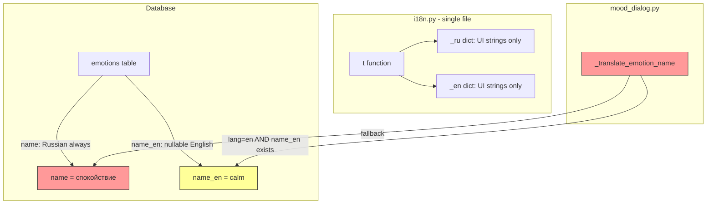
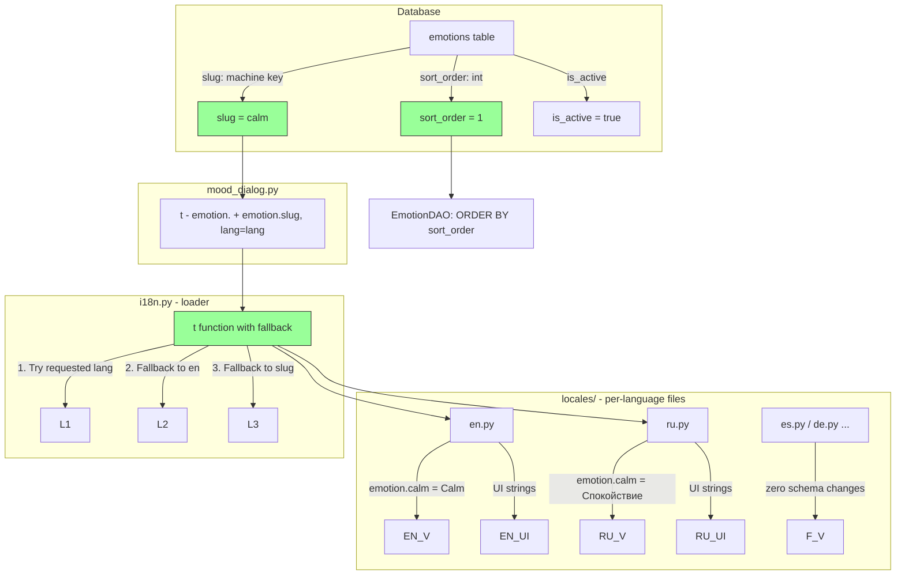
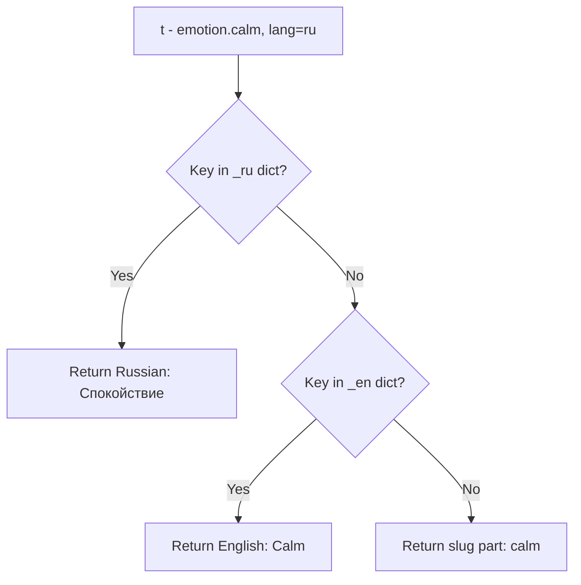
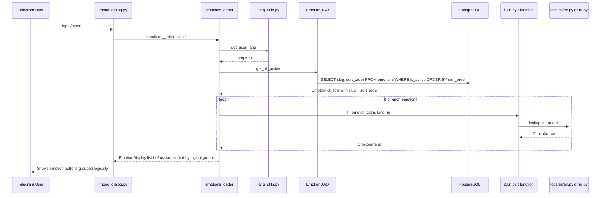
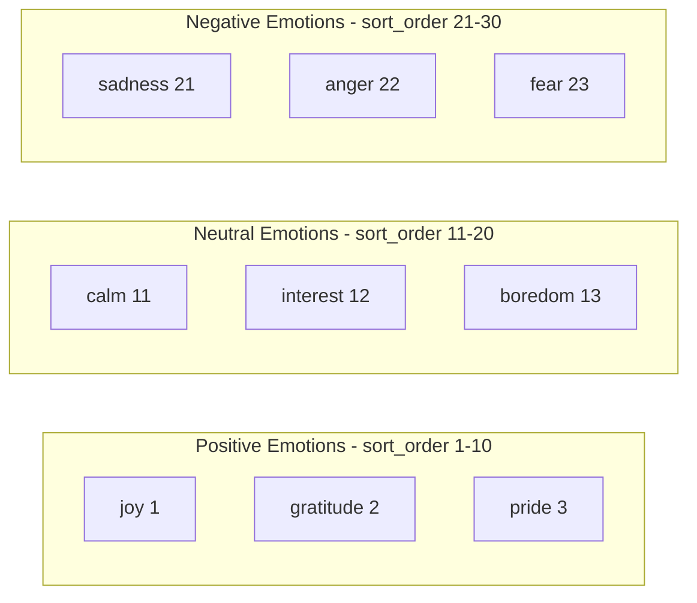
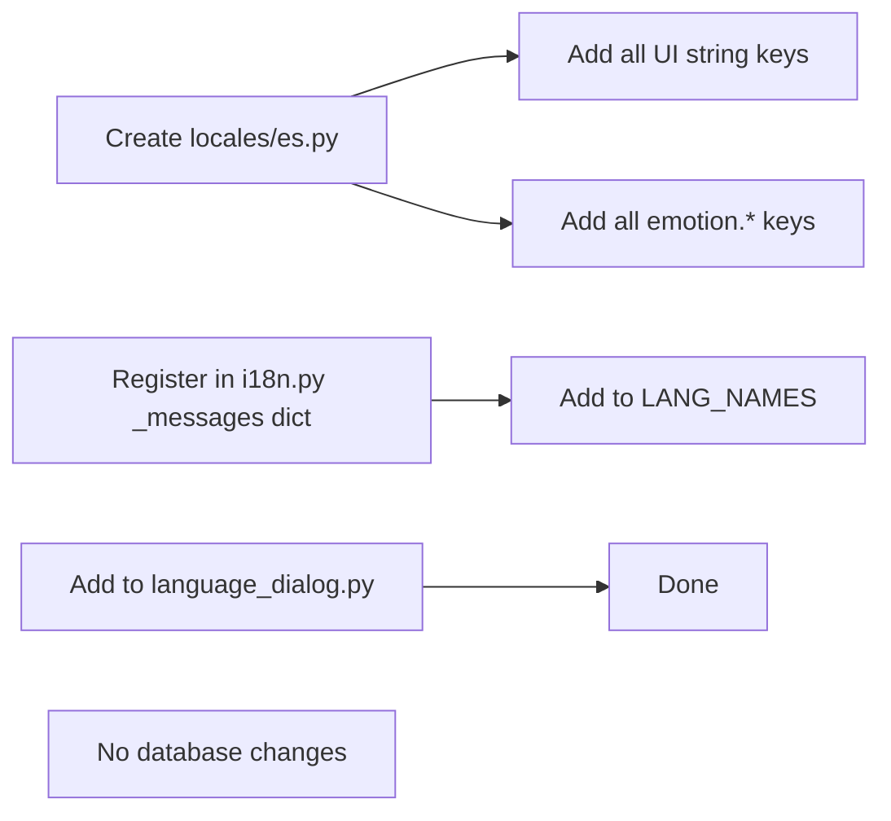

# Plan: English-Primary Emotions + Unified i18n

## Goal

1. Make English the primary/default language for emotions in the database
2. Unify emotion name translations with the existing `t()` i18n system
3. Split i18n dicts into per-language locale files
4. Support 50+ emotions with custom sort order (logical grouping, not alphabetical)
5. Fallback to slug value when no i18n translation exists

---

## Current Architecture (Problems)



**Problems:**
- `name` column is always Russian — English is treated as secondary
- Adding a 3rd language requires a new column per language — does not scale
- Emotion translations live in DB columns; UI translations live in Python dicts — two separate systems
- `EmotionDAO.get_all_active()` orders by Russian `name` — wrong sort for English users
- `_translate_emotion_name()` is a one-off function disconnected from the `t()` system
- All translations crammed into one `i18n.py` file — will grow unwieldy with 50+ emotions
- Alphabetical sorting only — no way to group emotions logically

---

## Proposed Architecture

### Core Idea: Slug + sort_order in DB, all names in locale files



---

## New File Structure

```
app/bot/
    i18n.py              # t() function + locale loader (slim)
    locales/
        __init__.py      # empty
        en.py            # _en dict: UI strings + emotion.* keys
        ru.py            # _ru dict: UI strings + emotion.* keys
```

---

## New `emotions` Table Schema

| Column | Type | Change |
|--------|------|--------|
| `id` | UUID, PK | unchanged |
| `slug` | String(100), UNIQUE, NOT NULL | **NEW** — replaces `name` and `name_en` |
| `sort_order` | Integer, NOT NULL | **NEW** — custom display order for logical grouping |
| `is_active` | Boolean, default true | unchanged |
| `created_at` | Timestamp | unchanged |
| `updated_at` | Timestamp | unchanged |

The old `name` and `name_en` columns are **dropped**.

---

## Locale File Format

### `app/bot/locales/en.py`

```python
_en = {
    # --- shared buttons ---
    "btn.ok": "OK",
    "btn.cancel": "Cancel",
    "btn.back": "Back ↩️",
    # --- mood dialog ---
    "mood.select_header": "Choose 3 emotions you are feeling right now",
    "mood.selected_header": "You selected: {choices} ({count} of {max})",
    # ... other UI strings ...
    # --- emotions ---
    "emotion.calm": "Calm",
    "emotion.joy": "Joy",
    "emotion.anxiety": "Anxiety",
    # ... all 50+ emotions ...
}
```

### `app/bot/locales/ru.py`

```python
_ru = {
    # --- shared buttons ---
    "btn.ok": "OK",
    "btn.cancel": "Отмена",
    "btn.back": "Назад ↩️",
    # --- mood dialog ---
    "mood.select_header": "Выберите 3 эмоции, которые вы испытываете прямо сейчас",
    # ... other UI strings ...
    # --- emotions ---
    "emotion.calm": "Спокойствие",
    "emotion.joy": "Радость",
    "emotion.anxiety": "Тревога",
    # ... all 50+ emotions ...
}
```

---

## Updated `t()` Function with Fallback



In [`i18n.py`](app/bot/i18n.py):

```python
from app.bot.locales.en import _en
from app.bot.locales.ru import _ru

_messages = {"en": _en, "ru": _ru}

def t(key: str, lang: str | None = None, **kwargs) -> str:
    lang = lang or LANG
    # Fallback chain: requested lang -> en -> slug from key
    msg = _messages.get(lang, {}).get(key)
    if msg is None:
        msg = _messages.get("en", {}).get(key)
    if msg is None:
        # Extract slug from key like "emotion.calm" -> "calm"
        msg = key.split(".")[-1].replace("_", " ").title()
    return msg.format(**kwargs) if kwargs else msg
```

---

## Data Flow After Changes



---

## Sort Order: Logical Grouping

The `sort_order` integer column lets you define any display order. Example grouping:



You'll assign `sort_order` values when providing the 50+ emotion list. The DAO simply does `ORDER BY sort_order`.

---

## Scalability: Adding a New Language



**Zero schema changes. Zero migrations for emotions.** Just create a new locale file.

---

## Files to Change

### 1. Create `app/bot/locales/__init__.py` — empty

### 2. Create `app/bot/locales/en.py` — English locale dict

Contains all current `_en` strings from `i18n.py` plus `emotion.*` keys.

### 3. Create `app/bot/locales/ru.py` — Russian locale dict

Contains all current `_ru` strings from `i18n.py` plus `emotion.*` keys.

### 4. Update `app/bot/i18n.py` — slim loader

- Remove inline `_en` / `_ru` dicts
- Import from `locales/en.py` and `locales/ru.py`
- Add fallback chain: requested lang → en → slug from key

### 5. New Migration: `add_emotion_slug_and_sort_order.py`

- Add `slug` column — populated from current `name_en` values, lowercased
- Add `sort_order` column — populated with sequential integers
- Drop `name` column
- Drop `name_en` column
- `slug` becomes NOT NULL with UNIQUE constraint

### 6. Update `app/dao/models.py` — Emotion model

```python
class Emotion(Base):
    __tablename__ = "emotions"

    id: Mapped[uuid.UUID] = mapped_column(primary_key=True, default=uuid.uuid4)
    slug: Mapped[str] = mapped_column(String(100), unique=True)
    sort_order: Mapped[int] = mapped_column(default=0)
    is_active: Mapped[bool] = mapped_column(Boolean, default=True)
```

### 7. Update `app/bot/user/mood_dialog.py`

- Delete `_translate_emotion_name()` function
- Replace with `t(f"emotion.{e.slug}", lang=lang)` in both getters
- Keep `EmotionDisplay` dataclass

### 8. Update `app/dao/emotion_dao.py`

- Change `order_by(Emotion.name)` → `order_by(Emotion.sort_order)`

### 9. Update existing migrations for consistency

- Update seed data in `e3f4a5b6c7d8` to use English slugs + sort_order
- Update `a1b2c3d4e5f6` to match new schema

### 10. Update `AGENTS.md` and `README.md`

---

## Waiting On

- **50+ emotion list** from user — once provided, we populate locale files and migration seed data
- **Sort order assignments** — user will assign logical grouping order later (can start with sequential integers)

---

## Implementation Order

1. Create locale files with existing 20 emotions + UI strings
2. Refactor `i18n.py` to import from locales + add fallback
3. Update `Emotion` model: add `slug`, `sort_order`; drop `name`, `name_en`
4. Write migration
5. Update `mood_dialog.py` to use `t()` for emotion names
6. Update `EmotionDAO` ordering
7. Update existing migrations for consistency
8. Update docs
9. Later: plug in the 50+ emotion list with sort_order values
